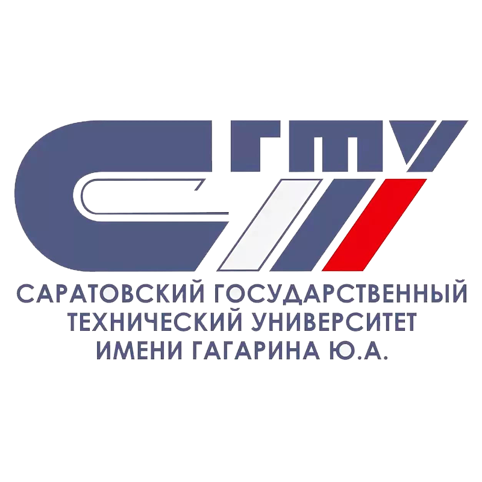
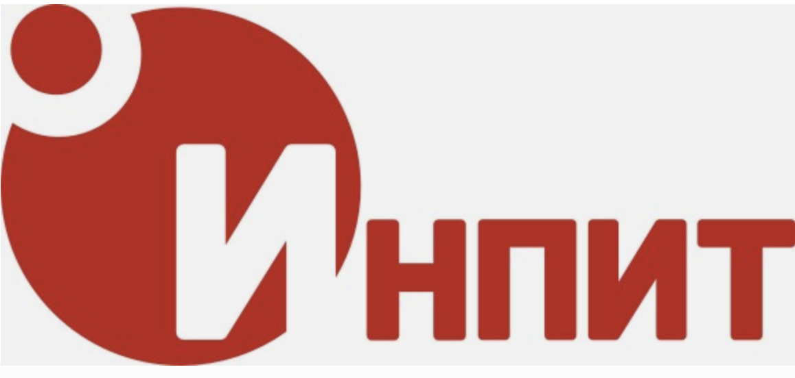

### Привет всем! 👋
### :woman_technologist: Меня зовут Елена! 
### Я - Junior QA Automation Engineer на Java.

## :woman_student: Образование

## :arrow_forward: Используемые инструменты

## :writing_hand: Контакты 

